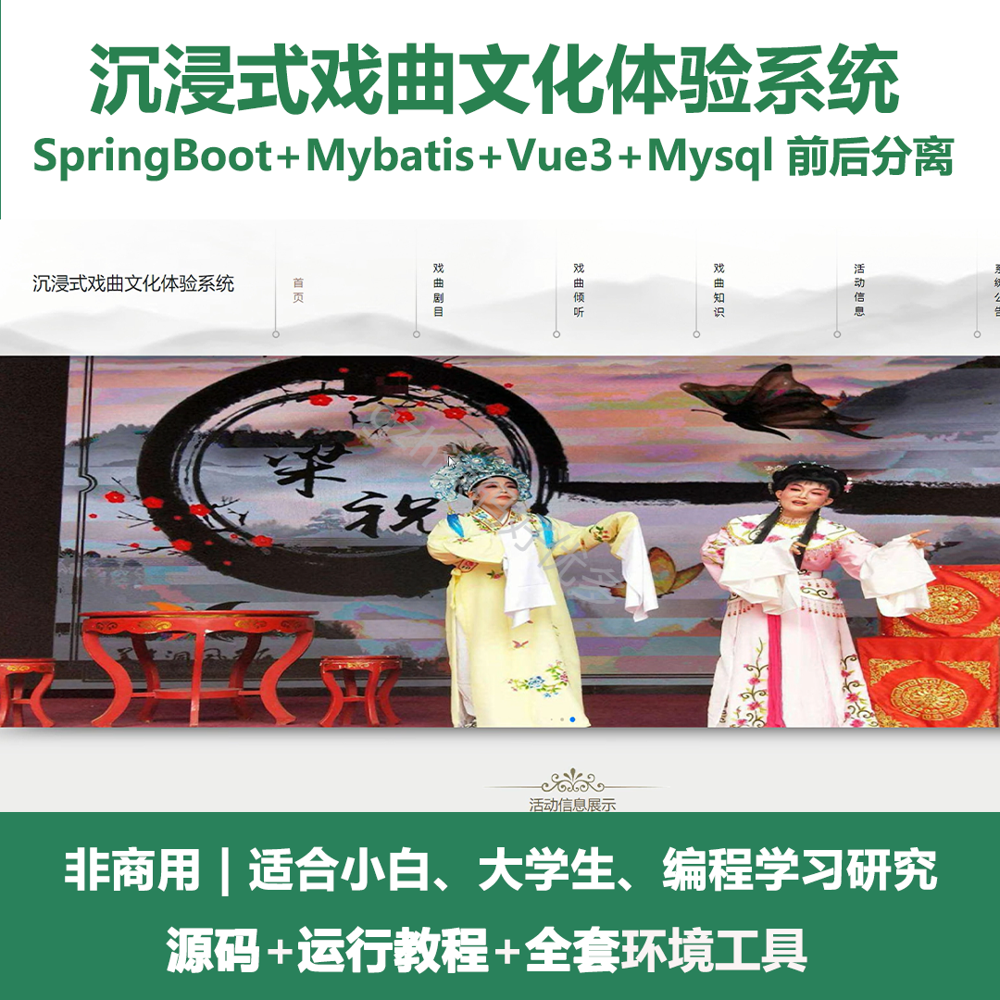
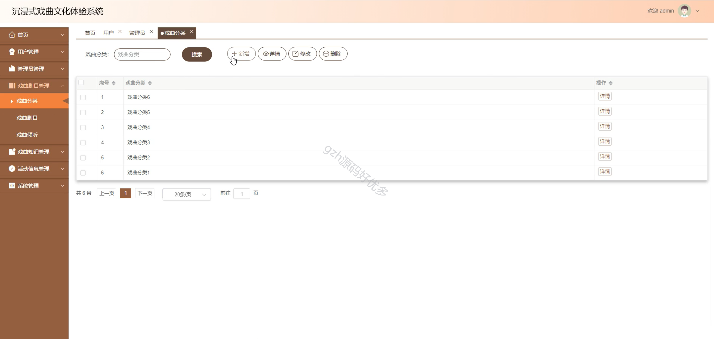
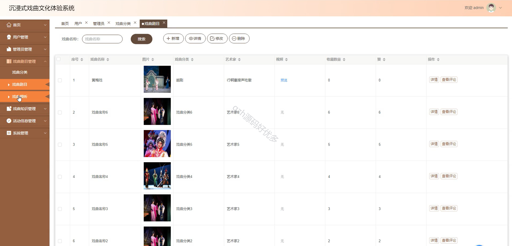
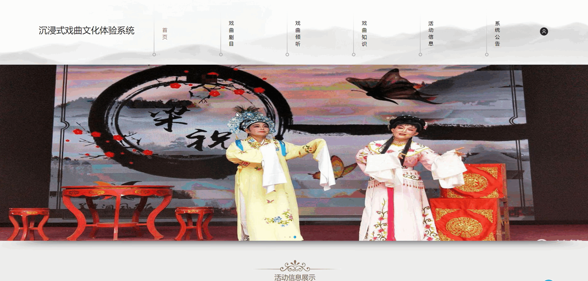
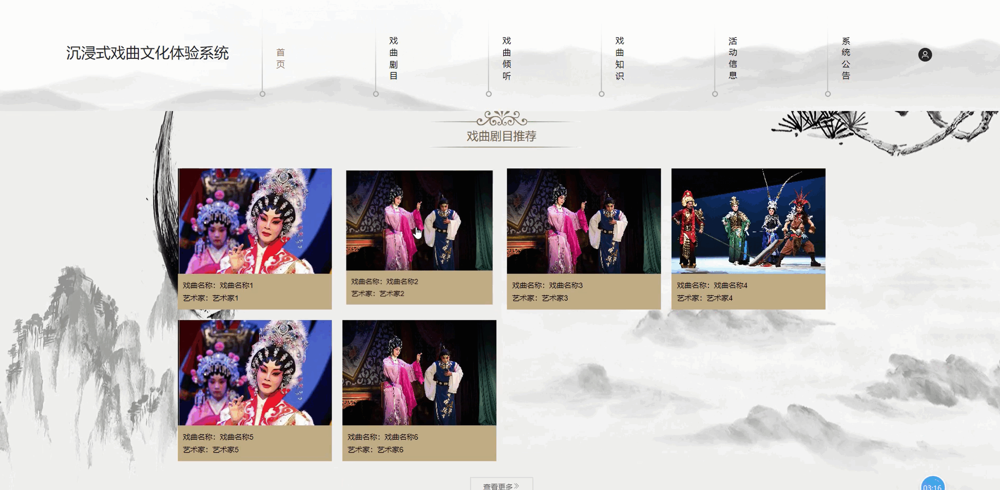
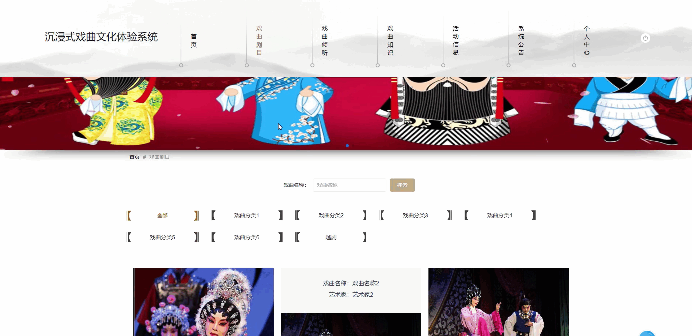
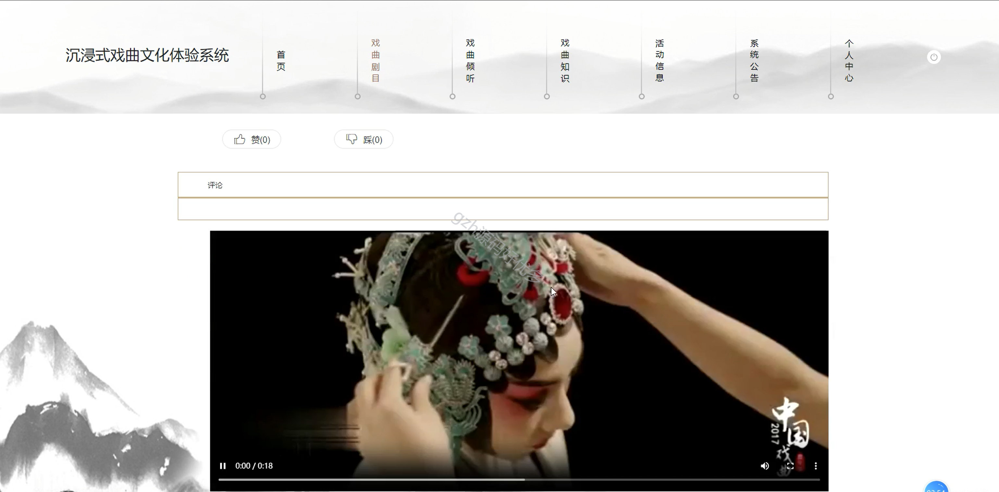
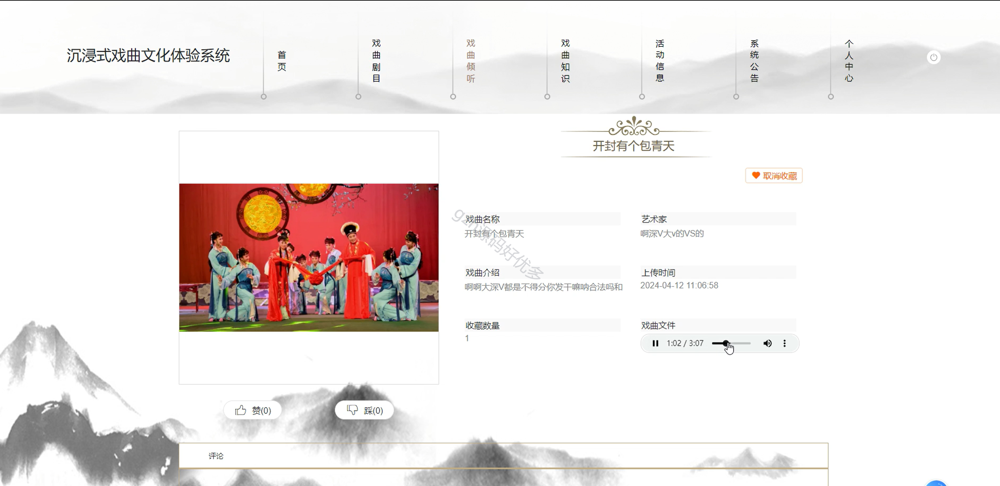
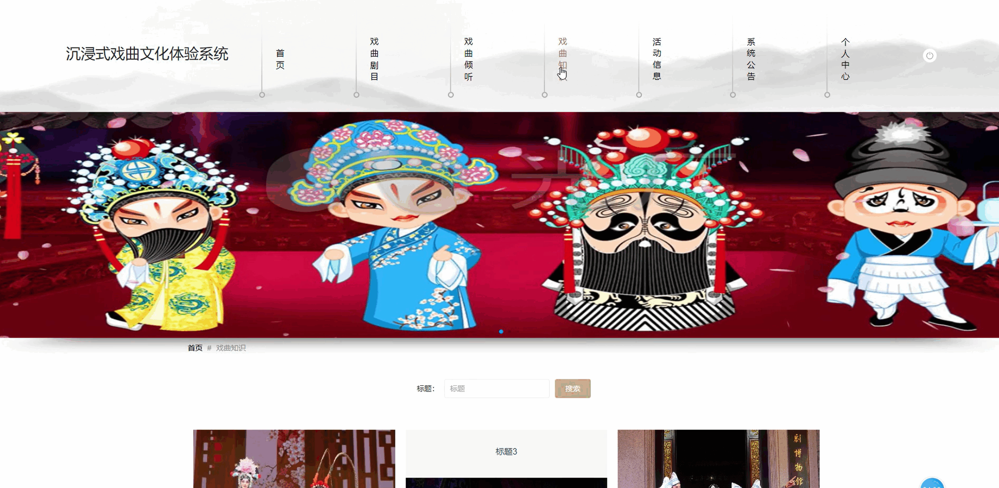
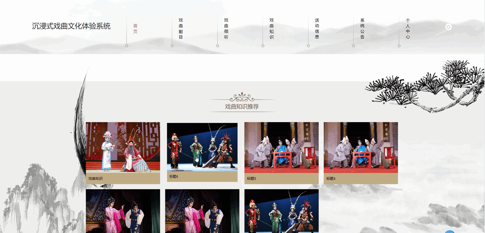

# springbootA357
springbootA357沉浸式戏曲文化体验系统Vue3
 
## 查看主页获取源码

### 一、作品包含

源码+数据库+全套环境和工具资源+部署教程

### 二、项目技术

前端技术：Html、Css、Js、Vue3、Element-plus

数据库：MySQL

后端技术：Java、Spring Boot、MyBatis

  

### 三、运行环境

开发工具：IDEA/eclipse

数据库：MySQL5.7

数据库管理工具：Navicat10以上版本

环境配置软件： JDK1.8+Maven3.6.3

前端Nodejs：16

### 四、项目介绍
项目编号：springbootA357

沉浸式戏曲文化体验系统，提供戏曲知识介绍、经典剧目展示，让用户获得沉浸式体验，便于其深入了解、学习和感受戏曲魅力，同时为戏曲文化传播发展提供数据支持，推动戏曲文化传承与创新。

该沉浸式戏曲文化体验系统支持用户登录，具备戏曲剧目展示与搜索、戏曲分类、戏曲倾听、戏曲知识学习、活动信息查看、系统公告浏览、个人中心管理等功能，还便于管理员对用户、戏曲分类、剧目、知识及活动信息等进行管理 。 
### 五、运行截图

  
